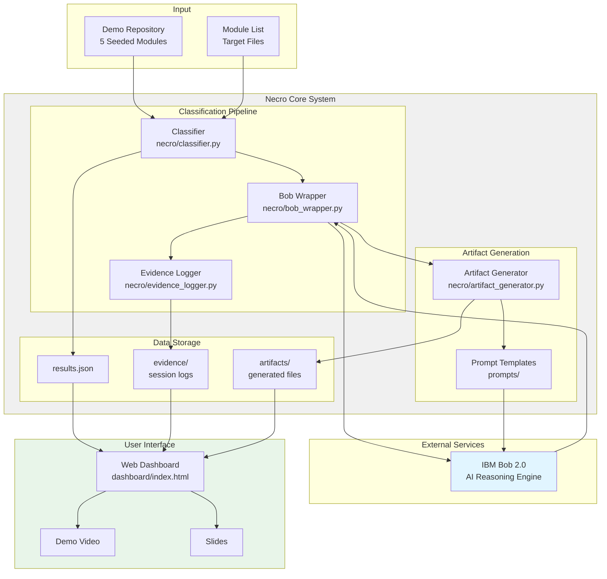
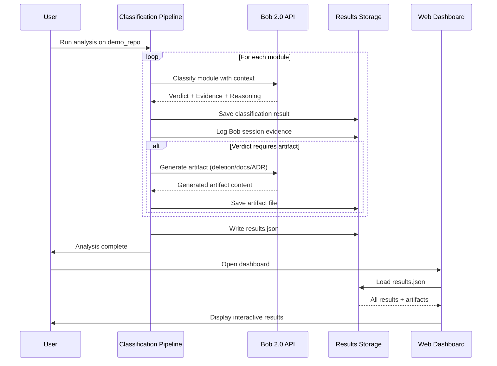
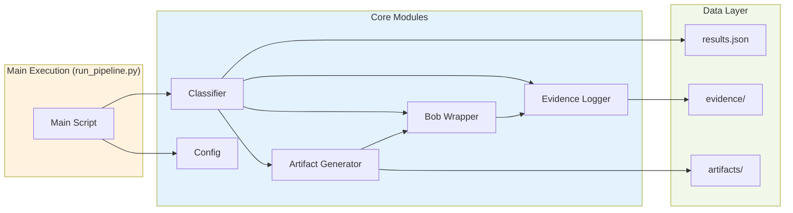

# Necro Technical Architecture
## System Design & Data Flow

---

## High-Level Architecture



---

## Data Flow Sequence



---

## Module Interaction Diagram



---

## Component Specifications

### 1. Bob Wrapper (`necro/bob_wrapper.py`)

**Purpose:** Abstract Bob 2.0 API/CLI interface for flexible integration

**Key Methods:**
- `analyze_module(module_path, repo_context)` → Classification result
- `generate_artifact(module_info, artifact_type)` → Generated content
- `capture_session()` → Session evidence

**Design Principles:**
- Single responsibility: only handles Bob communication
- Configurable backend (API/CLI/mock for testing)
- Automatic session logging
- Structured output parsing with error handling

**Configuration Options:**
```python
{
    "bob_mode": "api",  # or "cli" or "mock"
    "api_endpoint": "https://bob.ibm.com/api/v2",
    "timeout": 60,
    "max_retries": 3,
    "log_sessions": true
}
```

---

### 2. Classifier (`necro/classifier.py`)

**Purpose:** Orchestrate module classification workflow

**Workflow:**
1. Load module source code
2. Gather repository context (file structure, imports, configs)
3. Format classification prompt
4. Call Bob via wrapper
5. Parse and validate response
6. Log evidence
7. Return structured result

**Output Schema:**
```python
@dataclass
class ClassificationResult:
    module_name: str
    module_path: str
    verdict: str  # Safe to Delete | Secretly Load-Bearing | Undocumented but Valuable | Normal
    confidence: str  # High | Medium | Low
    evidence: List[str]
    reasoning: str
    timestamp: datetime
    bob_session_id: str
```

---

### 3. Artifact Generator (`necro/artifact_generator.py`)

**Purpose:** Generate appropriate artifacts based on classification verdict

**Artifact Types:**

| Verdict | Artifact | Format |
|---------|----------|--------|
| Safe to Delete | Deletion patch + safety note | `.patch` + `.md` |
| Secretly Load-Bearing | ADR snippet + enhanced docstring | `.md` + `.py` |
| Undocumented but Valuable | Comprehensive documentation | `.md` |
| Normal | None | N/A |

**Generation Process:**
1. Select prompt template based on verdict
2. Format prompt with classification evidence
3. Call Bob for artifact generation
4. Parse and format output
5. Save to appropriate directory
6. Return artifact metadata

---

### 4. Evidence Logger (`necro/evidence_logger.py`)

**Purpose:** Capture and organize Bob session evidence for submission

**Evidence Structure:**
```
evidence/
├── module1_name/
│   ├── session.json          # Structured session data
│   ├── session.txt           # Human-readable log
│   ├── classification.md     # Classification details
│   └── screenshot.png        # (if available)
└── ...
```

**Logged Information:**
- Full prompt sent to Bob
- Bob's complete response
- Timestamp and session ID
- Token usage (if available)
- Any errors or retries

---

## Data Schemas

### results.json Schema

```json
{
    "$schema": "http://json-schema.org/draft-07/schema#",
    "type": "object",
    "properties": {
        "generated_at": {"type": "string", "format": "date-time"},
        "demo_repo": {"type": "string"},
        "modules_analyzed": {"type": "integer"},
        "results": {
            "type": "array",
            "items": {
                "type": "object",
                "properties": {
                    "module_name": {"type": "string"},
                    "module_path": {"type": "string"},
                    "verdict": {
                        "type": "string",
                        "enum": ["Safe to Delete", "Secretly Load-Bearing", "Undocumented but Valuable", "Normal"]
                    },
                    "confidence": {
                        "type": "string",
                        "enum": ["High", "Medium", "Low"]
                    },
                    "evidence": {
                        "type": "array",
                        "items": {"type": "string"}
                    },
                    "reasoning": {"type": "string"},
                    "artifact_path": {"type": "string"},
                    "evidence_path": {"type": "string"},
                    "timestamp": {"type": "string", "format": "date-time"}
                },
                "required": ["module_name", "verdict", "confidence", "evidence"]
            }
        }
    },
    "required": ["generated_at", "modules_analyzed", "results"]
}
```

---

## Security & Error Handling

### Error Handling Strategy

**Bob API Failures:**
- Retry with exponential backoff (max 3 attempts)
- Fall back to mock responses for testing
- Log all errors with context
- Continue pipeline with partial results

**Parsing Errors:**
- Validate JSON schema before processing
- Provide default values for missing fields
- Log malformed responses
- Mark result as "Low Confidence" if parsing fails

**File System Errors:**
- Create directories automatically
- Handle permission errors gracefully
- Validate file paths before writing
- Provide clear error messages

### Security Considerations

**For MVP (Hackathon):**
- No authentication required (local-only)
- No sensitive data handling
- Read-only access to demo repo
- Generated artifacts are safe (no code execution)

**For Production (Future):**
- API key management for Bob
- User authentication
- Rate limiting
- Input sanitization for arbitrary repos
- Sandboxed code execution for analysis

---

## Performance Considerations

### Optimization Strategies

**Bob API Calls:**
- Sequential processing (no parallel calls for MVP)
- Cache Bob responses for repeated modules
- Timeout after 60 seconds per call
- Batch context loading where possible

**File Operations:**
- Stream large files instead of loading entirely
- Use generators for directory traversal
- Lazy load module code only when needed

**Dashboard:**
- Client-side rendering (no server processing)
- Lazy load evidence details on expand
- Compress large artifacts for download

### Expected Performance

| Operation | Time Estimate |
|-----------|---------------|
| Single module classification | 10-30 seconds |
| Artifact generation | 5-15 seconds |
| Full pipeline (5 modules) | 2-5 minutes |
| Dashboard load | < 1 second |

---

## Testing Strategy

### Unit Tests

**Bob Wrapper:**
- Mock API responses
- Test error handling
- Validate output parsing

**Classifier:**
- Test with sample modules
- Verify evidence extraction
- Check result formatting

**Artifact Generator:**
- Test each artifact type
- Validate output format
- Check template rendering

### Integration Tests

**End-to-End Pipeline:**
- Run full pipeline on demo repo
- Verify all 5 modules classified
- Check artifacts generated correctly
- Validate results.json structure

**Dashboard:**
- Load results.json
- Test interactive features
- Verify artifact downloads

### Manual Testing Checklist

- [ ] Each verdict type represented in results
- [ ] Evidence is specific and actionable
- [ ] Artifacts are valid and useful
- [ ] Dashboard displays correctly
- [ ] Evidence logs are complete
- [ ] No crashes or errors in pipeline

---

## Deployment & Serving

### Local Development

```bash
# Run classification pipeline
python scripts/run_pipeline.py

# Serve dashboard
python scripts/serve_dashboard.py
# Opens http://localhost:8000
```

### Demo Environment

**Requirements:**
- Python 3.10+
- Bob 2.0 API access
- Modern web browser
- 2GB RAM minimum

**Setup Time:** < 5 minutes

---

## Extensibility Points

### Future Enhancements

**Multi-Repo Support:**
- Add repo configuration management
- Support GitHub/GitLab integration
- Handle different project structures

**Advanced Analysis:**
- Custom call-graph generation
- Dependency impact analysis
- Historical usage tracking

**Automation:**
- Automatic PR creation
- CI/CD integration
- Scheduled scans

**UI Improvements:**
- Interactive code viewer
- Diff visualization
- Filtering and search

---

## Technology Stack Summary

| Layer | Technology | Rationale |
|-------|-----------|-----------|
| Backend | Python 3.10+ | Fast prototyping, rich ecosystem |
| AI Integration | IBM Bob 2.0 | Core requirement, full-repo reasoning |
| Data Storage | JSON files | Simple, no DB overhead for MVP |
| Frontend | HTML/CSS/JS | No build step, fast iteration |
| Server | Python http.server | Built-in, sufficient for demo |
| Testing | pytest (optional) | Standard Python testing |

---

## Glossary

**Module:** A function, class, or file being analyzed for usage

**Verdict:** Classification result (Safe to Delete, Load-Bearing, etc.)

**Evidence:** Specific code references supporting the verdict

**Artifact:** Generated output (patch, docs, ADR) based on verdict

**Session:** A single interaction with Bob 2.0 for analysis

**Demo Repo:** Seeded test repository with 5 known cases

---

*This architecture is designed for rapid prototyping and clear demonstration of Bob 2.0's capabilities in a hackathon setting.*